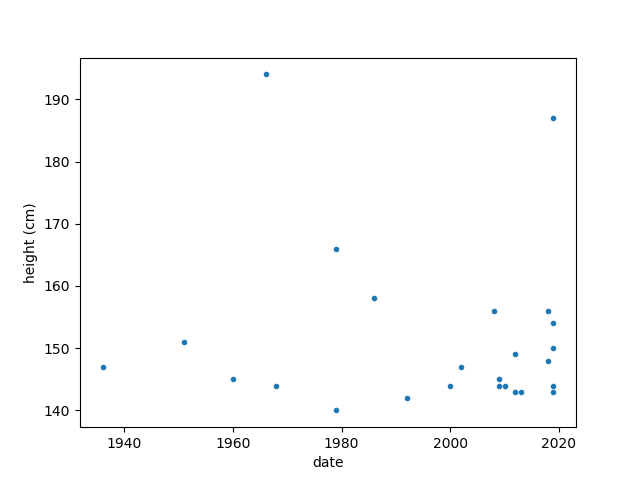
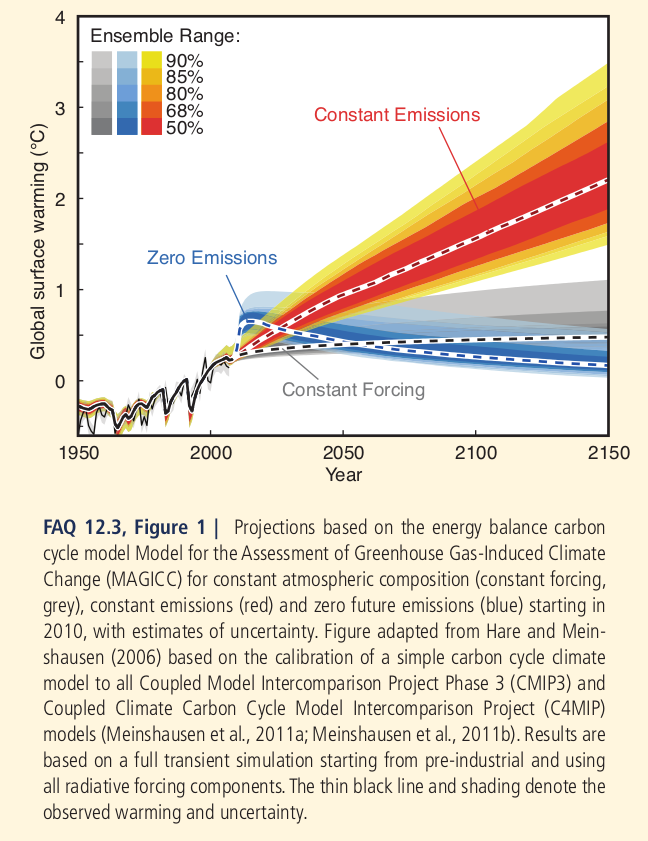
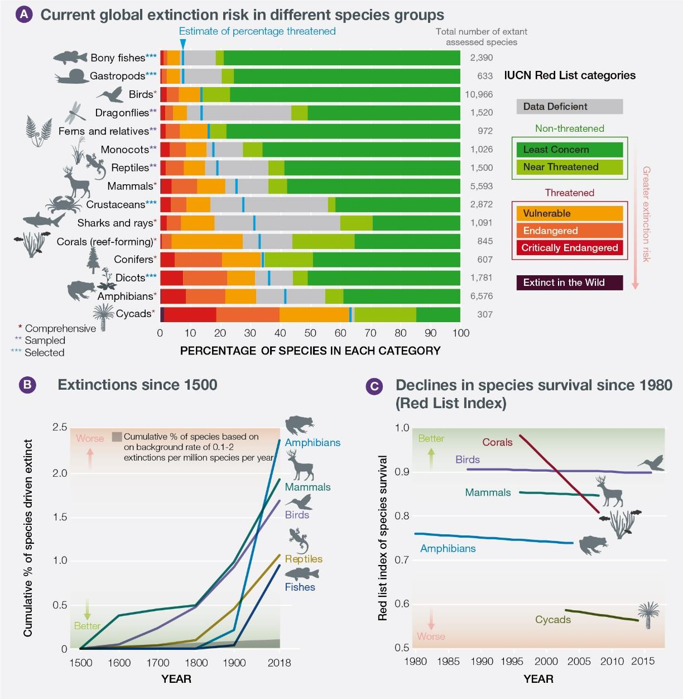

### Novembre 17th, 2019. *Higher Tide*

Exactly two months ago *The Economist* weekly newspaper (see [1]) 
publised a Briefing entitled *The rising seas*.
The main points of the article are:

- 2/3 of the world's largest cities lie along the coast line,
a billion people live no more than 10 meters above sea level;
- Global mean sea level has been rising since 1993
by a rate of 2.7mm to 3.5mm a year;
- the IPCC report (see [2]) says GMSL rose by around 19cm in the
20th Century;
- in a +3C degree scenario thermal expansion alone
would produce a GMSL rise between 60cm and 180cm by 2100 (from now?);
- today's residual ice sheets are the equivalent 
of less than 70m of sea level rise, 
and the accelerating melting of the West Antartic
ice sheets would add +3.5m to the GMSL by 2200.

#### How's that possible

Thermal expansion:
Let *f=0.0001* be the volume change of water with
the increase of one degree Celsius (see the physical properties of 
water [5]),
*V=1.35e18 m3* the volume of water on Earth's surface (from wikipedia),
*R=6371 km* the mean radius of the Earth.
We can compute the surface area *S=4 Pi R^2*,
and the increase of water volume with one degree increase in temperature
*dV = fV = 1.35e14 m3*, then we can cover the entire Earth surface with a 
layer of *h=dV/S=26 cm*.

Melting of inland ice:
To get a rough estimate of how much this factor could
affect the sea level rise in the future we can do a similar 
calculation as in the previous paragraph,
but use *dV* as the ammount of water that would be added
to the world oceans if the inland ice melts.
For instance Greenland harbors *dV = 2'850'000* cubic kilometers
of ice. That volume of water is enough to cover
Earth's surface with a layer of *h = dV/S = 5.6* meters high.
Antarctica on the other hand
contains *dV=26.5* million cubic kilometers of ice,
which is equivalent to *h=dV/S=52* meters of water 
over the entire Earth's surface.

Astronomical tides, storm surges and sinking land
can add up to make matters worse.
That was the case for Venice's last flood
on November 2019 [4], an kind of event which
is ever more frequent:

*Acque alte eccezionale a Venezia.*

Repository:

- [1]: [Economist 17-08-2018, Higher Tide](./economist_files/2019-08-17_Tide.pdf)

References

- [2]: [IPCC, 2018: Global Warming of 1.5°C.](https://www.ipcc.ch/sr15)
- [3]: [DW The Climate Exodus](https://www.youtube.com/watch?v=cl4Uv9_7KJE)
- [4]: [CBSN Venice flood](https://www.cbsnews.com/news/climate-change-blamed-for-higher-tides-creating-uncertainty-for-venices-canals-60-minutes-2020-01-12/)
- [5]: [Wikipedia: Water](https://en.wikipedia.org/wiki/Properties_of_water)
- [6]: [IPCC 2019: Special report on the Ocean and Cryosphere in a Changing Climage, Chapter 4](https://www.ipcc.ch/srocc/)
- [7]: [Wikipedia: Acqua alta](https://it.wikipedia.org/wiki/Acqua_alta)

### July 3rd, 2019. *Doctors against climate catastrophe/ Dottori contro la catastrofe climatica*

'We are qualified medical doctors united by our distress at the minimal
response to looming environmental disaster.
We sympathise with current widespread protest, notably by children who will
be most affected. We urge government and
media to respond immediately and proportionately.'

Siamo medici professionisti uniti dalla sofferenza per la minima risposta
verso
la catrofe ambientale incombente.
Simpatizziamo con la protesta attuale e diffusa, in particolare ad opera
dei bambini che
saranno i maggiormente colpiti. Chiediamo al governo di intervenire
immediatamente e proporzionatamente.

'As caring professionals we cannot countenance current policies that push
the world’s most
vulnerable towards environmental catastrophe. We are particularly alarmed
by the effects of
rising temperatures on health and heed predictions of societal collapse and
consequent mass migration.
Such collapse risks damage to physical and mental health on an
unprecedented scale.'

In quanto dediti professionisti, non possiamo tollerare le politiche
correnti che stanno
spingendo i più vulnerabili verso la catastrofe ambientale. Siamo
particolarmente allarmati per
l'effetto dell'aumento delle temperature sulla salute e prestiamo
attenzione alle predizioni
di collasso sociale e conseguenti migrazioni di massa.
Tale collasso rischia di danneggiare la salute fisica e mentale su una
scala senza precedenti.

'Present policies and responses are woefully inadequate. The
Intergovernmental Panel
on Climate Change warns that we have only 11 years to halve global
emissions to meet
their 1.5C target, yet last year our global emissions rose yet again. It
will be a massive
task to avoid catastrophic warming and we need radical action now. Our
unchecked consumption,
dependence on fossil fuels and decimation of ecosystems continue.
The diagnosis is clear and the treatment urgent. Yet politicians
prevaricate and global emissions
still rise.'

Le politiche attuali e le risposte sono tristemente inadeguate.
L'Interngovernmental Panel on Climate Change
mette in guardia sul fatto che abbiamo solo 11 anni per dimezzare le
emissioni globali al fine
di ottenere l'obiettivo degli 1.5°C, eppure lo scorso anno le nostre
emissioni globali sono di nuovo
aumentate. Sarà un'impresa enorme evitare un riscaldamento catastrofico e
abbiamo bisogno di un'azione radicale,
ora. I nostri consumi incontrollati, la dipendeza dai combustibili fossili
e la decimazione degli ecosistemi
sta continuando.
La diagnosi è chiara e la cura urgente. Tuttavia i politici prevaricano e
le emissioni globali
continuano ad aumentare.

Governments abrogate their responsibility when pursuing grossly inadequate
policies that
risk environmental collapse. Non-violent direct action then becomes the
reasonable choice for responsible individuals.

I governi abrogano la loro responsabilità quando perseguono politiche
inadeguate che stanno portando
al rischio del collasso ambientale. L'azione diretta non-violenta allora
diventa la scelta logica
per individui responsabili.

We support the following key demands, which parallel those made by
Extinction Rebellion:
- governments and media should be honest about the challenges and urgency
of tackling ecological disaster;
- governments should effect carbon neutrality within the IPCC timeframe;
- governments should establish and be led by Citizens’ Assemblies to enable
climate and ecological justice.

Noi supportiamo le seguenti richieste chiave, che sono parallele a quelle
fatte da Extincion Rebellion:
- i governi e i media devono essere onesti riguardo alle sfide e
all'urgenza di affrontare il disastro ecologico;
- i governi devono mettere in atto la neutralità di carbonio entro i
termini temporali dell'IPCC;
- i governi devono stabilire ed essere guidati da delle Assemblee Cittadine
per rendere possibile la giustizia
climatica ed ecologica.

Firmato da:
- James Underwood Past president, Royal College of Pathologists
- Professor John Middleton President, UK Faculty of Public Health
- Professor David Pencheon Honorary professor of health and sustainable
development, University of Exeter, UK
- Dr Bing Jones Retired associate specialist in haematology
- Dr Terry Kemple Past president, Royal College of General Practitioners

Read the letter in full and more than 1,000 signatures at/La lettera completa si trova su 
https://cancerofclimatechange.org/about/

Source:
https://www.theguardian.com/environment/2019/jun/27/doctors-against-climate-catastrophe

See also:
- [The Lancet's Countdown report on health and climate change](./lancet_files/watts_2018.pdf)  

### June 10th, 2019. *Civil disobedience to stop ecocide*.

Roger Hallam, co-founder of *Extinction Rebellion*,
talks about mass denial and the failure of the 'Elites' 
regarding the issue of Climate Change. 
The main points of this interview, from the words of Roger are:

Roger: "one of the main things that is avoided by the establishment as it were
is to look at feedback mechanisms which were already baked into the system ...
one is the carbon lag ... and then there's something called global dimming which means
that when you have removed the fossil fuels from the system, that
reduces the pollution levels and that lets through more of the sun's rays
and that warms the Earth up ..."

About the *carbon lag*, the FAQ point 12.3 of the IPCC report 2013 states:

"... As a result of the multiple time scales in the climate
system, the relation between change in emissions and climate
response is quite complex, with some changes still occurring
long after emissions ceased. Models and process understanding
show that as a result of the large ocean inertia and the long lifetime
of many greenhouse gases, primarily carbon dioxide, much of the
warming would persist for centuries after greenhouse gas emission have 
stopped... if concentration of greenhouse were
held constant at present day level, the Earth surface would still
continue to warm by about 0.6⁰C over the 21st century relative to the 
year 2000. This is the climate commitment to current concentrations
(or constant composition commitment), shown in grey in FAQ 12.3, Figure 1.
... Eliminating short-lived negative forcings from sulphate
aerosols at the same time (e.g. by air pollution reduction measures)
would cause a temporary warming of a few tenths of a degree, as
shown in blue in FAQ 12.3, Figure 1."

Roger: "... I think our culture in in massive denial and understandably so
because 30 years ago before everything was broadly honky-dory, and we were 
going to be able to have a high consumer lifestyle,
and now we've just faced this reality ... now the science would seem 
to imply that it's going to need a massive reduction in living standards 
because we're gonna have to put so much of our collective effort into dealing with
this situation which is reducing carbon emissions and taking the carbon
out of the atmosphere ... unfortunately there is this tendency in the political
class on the left and the right to lie to the population and say we can still
get out of this problem without a major reconfiguration of the economy
and that is inevitably going to mean lower living standards ..."

Roger: "we're not going to be dealing rationally with this problem.
I mean the idea that we're just all suddenly going to wake up and decide
to do the right thing it's a bit of a liberal illusion.
The most, I think the most predictable path is that we're going to slide into
fascism and the reason for that is because the elites are going to attempt to
protect their interest in the face of ever greater stress and when that happens you get
all for a chair in solutions and we've seen that across the world over the last ten years
and increasingly the rich and powerful will form right-wing movements and they'll
start to hollow out democracy because their main interest is protecting their own
wealth and power. Now obviously this is a completely suicidal mission because it's going
to end in their own destruction anyway but you can see the logic of that.
And what that means for people that are progressive or claim to be liberal is
you've got to make a choice. You know, because it's not going to get any easier every year that
goes on, right, they're going to sort this thing out with some major distress and upheaval
or we're going to go into a complete social hell; and those are the two options..."

Roger: "... unless people engage and go through emotion, they will not find the strength to 
engage in resistance. So we're not in the territory anymore of sending emails or going on
a to be marchers, you know, writing to representatives and what-have-you. That's all failed.
What we're in business of doing now as has happened in previous times in 20th century
in 19th century, you just need to look at history, people in would go to the streets and 
they blockade it, and they make sacrifices and they potentially get killed.
And that's where we're at. There's no dispute about this anymore, that's where we're at..."

See also:
- [Interview with Roger Hallam](https://www.youtube.com/watch?v=220tv9Jktmg)
- [IPCC report 2013](https://www.ipcc.ch/site/assets/uploads/2018/02/WG1AR5_all_final.pdf)

### June 1st 2019. *A new report confirms that life on Earth is in trouble*.

"A million species of animals and plants are threatened with extinction.
Three quarters of the world's land and two-thirds of its marine environments
have been 'significantly altered' by human action. 
Urban areas have doubled in size in just the past 30 years. 
More than 85% of wetlands have been lost. More than 90% of ocean fish
stocks are being harvested at or above sustainable levels.
There are among claims made in a report published on May 6th by the 
Intergovernmental Science-Policy Platform on Biodiversity and Ecosystem
Services, a big international quango..." *The Economist*, May 11th 2019. 

Repository:

- [Full IPBES report pdf](./ipbes_files/spm_6_may_2019.pdf)

See also:
- https://www.ipbes.net/news/million-threatened-species-thirteen-questions-answers

- https://www.iucnredlist.org/

